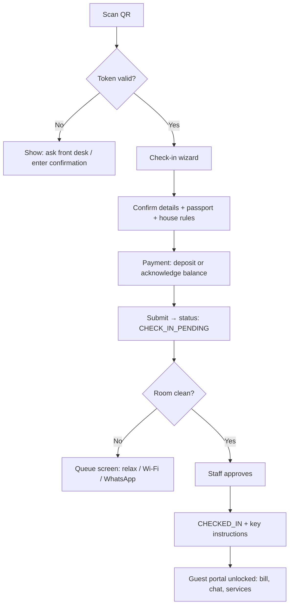

# Instant Check-In / Check-Out UX Research

**Project:** amaldives STAY  
**Scope:** Maldives guesthouse PMS (1–20 rooms), guest mobile portal, QR, Stripe, FPOS/BML POS, flight arrivals  
**Date:** June 2026  
**Purpose:** Actionable UX + technical plan for instant check-in/check-out, grounded in 2024–2026 industry patterns and the current STAY codebase.

---

## Executive summary

Industry leaders (Marriott Bonvoy, Hilton Honors, Canary, Ariane) converge on a **web-first, app-free** pre-arrival flow: guest completes registration and payment on their phone, staff approve, then the guest receives **room-ready confirmation + key access instructions**. For Maldives guesthouses, **physical key handoff at a small front desk remains the realistic default**; digital keys are out of scope for most properties.

STAY already has strong foundations: `guestToken` portal (`/guest/[token]`), arrivals pipeline, Malé flight board, folio/checkout modal, FPOS webhooks, and notification outbox. The gap is a **unified check-in journey** that connects pre-arrival → QR at property → staff approval → key issue → express checkout.

**Recommended MVP:** Pre-arrival web check-in on existing guest portal + property QR deep-link + staff “Approve & issue key” on arrivals board. **Phase 2:** WhatsApp delivery, room-ready push, in-app Stripe checkout. **Phase 3:** Split folios, late checkout automation, optional kiosk tablet mode.

---

## 1. Industry patterns (2024–2026)

### 1.1 Mobile check-in: chains vs boutique

| Pattern | Marriott / Hilton | Boutique / guesthouse (Canary, Guestara, SmartGuest) |
|--------|-------------------|------------------------------------------------------|
| **Channel** | Native loyalty app | **Web link** (no download) — 40–50% higher adoption |
| **Timing** | 24–48h before arrival | 48–72h before + day-of reminder |
| **Identity** | App profile + optional ID upload | Passport photo + signature on registration card |
| **Payment** | Card on file, pre-auth | Deposit/balance + pay-at-property option |
| **Room assignment** | Often day-of; sometimes room pick in app | Staff assigns when room is clean; guest notified |
| **Key delivery** | Mobile key in wallet | **Physical key at desk** or lockbox PIN |
| **Staff role** | Approve submission; exceptions only | Same — digital reduces desk time, not staff |

**Key insight (OpenKey, 2025):** Mobile check-in *without* a credible key path creates guest frustration. Either deliver a key (digital or “skip the queue, key waiting”) or set expectations clearly: “Complete registration now, collect key at desk in under 2 minutes.”

**Key insight (Guestara, 2025):** Target **≤2 minutes**, ≤6 screens, progress indicator, confirmation screen with room number, Wi‑Fi, checkout time, and escalation path (WhatsApp / front desk).

### 1.2 QR at kiosk / desk

Two distinct QR use cases (often conflated):

| QR type | Encodes | Guest action | Typical property |
|---------|---------|--------------|------------------|
| **Property QR** | Static URL: `https://{subdomain}.stay.amaldives.com/check-in` | Scan → enter confirmation + last name OR scan booking QR from email | Small guesthouse front desk |
| **Booking QR** | Opaque/signed token → `/guest/{token}?mode=checkin` | Scan → lands directly on pre-filled check-in wizard | Pre-arrival email, WhatsApp, confirmation PDF |
| **Pickup QR** (Ariane-style) | Short-lived code issued when room is **clean + assigned** | Scan at kiosk/tablet → confirm → key dispensed or staff notified | Properties with kiosk hardware |

**Pre-arrival vs at-desk scan:**

- **Pre-arrival (recommended primary):** Guest completes 80% on the boat or at the airport. Desk scan becomes optional verification only.
- **At-desk scan:** Fallback for walk-ins, OTA guests without email, or failed pre-arrival. Property QR + lookup is enough; do not require both.

### 1.3 Digital room keys vs physical handoff

| Approach | Fit for Maldives guesthouses | Notes |
|----------|------------------------------|-------|
| **Physical key / keycard** | **Default** | Matches 1–20 room properties, limited smart-lock CAPEX |
| **Lockbox / door code** | Common for after-hours | Code sent via WhatsApp when room ready |
| **Mobile BLE key** | Rare | Requires lock vendor integration (OpenKey, Salto, etc.) |
| **“Skip the queue” desk handoff** | **Best near-term UX** | Guest completes digital reg; staff prepares key; guest walks to labeled slot or counter |

STAY already tracks `cardIssued` on `ArrivalRecord` — extend this as the **key handoff checkpoint**, not a separate concept.

### 1.4 What “instant” means operationally

Instant check-in is not “guest assigns themselves a room without staff.” Industry standard (Canary, Ariane):

1. Guest submits digital registration + policies + payment authorization.
2. **Staff reviews** (often async while guest is in transit).
3. Housekeeping marks room clean → PMS triggers **“Room ready”**.
4. Guest receives notification → collects key or gets code.

For 1–2 staff properties, review can be **10-second approve** on the arrivals board, not a formal fraud desk.

---

## 2. Instant check-in flow UX

### 2.1 Guest scans QR at property

**Web vs native:** Use **responsive web** (Next.js App Router). No guest app. Optional “Add to Home Screen” for return visits during stay.

**Recommended entry URLs:**

```
# Property lobby QR (static, printed)
https://{subdomain}.stay.amaldives.com/arrive

# Booking-specific QR (dynamic, per reservation)
https://{subdomain}.stay.amaldives.com/guest/{guestToken}/check-in

# Staff desk tablet (same as guest, staff mode via auth)
/admin/arrivals?highlight={bookingId}
```

**Scan flow (at-desk, booking QR):**



### 2.2 Identity verification

Maldives guesthouses must collect guest registration data (MIRA/tourism compliance). Tier by property settings:

| Level | Collect | When | STAY implementation |
|-------|---------|------|---------------------|
| **Light** | Name, email, phone, nationality, passport number | Pre-arrival | Form on guest portal |
| **Standard** | + passport photo upload | Pre-arrival or at desk | `POST /api/guest/[token]/check-in` with Vercel Blob upload |
| **Strict** | Staff visual check of physical passport | At desk only | Staff checkbox on arrivals board |

**UX rules:**

- Pre-fill from booking (`guest`, `adults`, `children`).
- One signature tap for house rules + cancellation policy (PDF stored on booking).
- Never block submission on slow upload — allow “complete at desk” fallback.

### 2.3 House rules delivery

- Show scrollable summary + checkbox: “I agree to house rules and property policies.”
- Link to full PDF (property `policies` JSON / uploaded doc).
- Store: `{ agreedAt, ip, userAgent, policyVersion }` on booking or new `CheckInSubmission` record.
- Resend rules in WhatsApp pre-arrival template (Phase 2).

### 2.4 Room assignment timing

| Strategy | Pros | Cons | STAY fit |
|----------|------|------|----------|
| **Assign at booking** | Simple | Room may change if maintenance | Already have `roomId` on `Booking` |
| **Assign at check-in approval** | Flexible | Requires clean-room queue | Recommended for instant flow |
| **Assign when clean** | Best guest expectation | Needs housekeeping integration | Tie to room status `AVAILABLE` |

**Recommended:** Keep `roomId` from booking as default. At check-in approval, staff can reassign if room not ready; guest sees **“Room X (or equivalent) — we’ll confirm when ready”** until `ArrivalRecord.status` reaches `AT_PROPERTY` + room clean.

**Room-not-ready screen (critical UX):**

- Estimated ready time (from housekeeping task or manual).
- Offer luggage storage, café/waiting area, Wi‑Fi.
- Push/WhatsApp when ready (notification type `ROOM_READY`).

---

## 3. Checkout UX

### 3.1 Bill compilation before departure

Industry standard (folio management best practice):

- **Night before:** Email/WhatsApp “preview folio” with itemized charges.
- **Morning of departure:** Final sync of minibar, F&B POS, late checkout fee.
- **Express checkout:** Guest confirms folio on phone; payment captured; skip desk.

STAY already compiles in `checkout-modal.tsx`:

- Room × nights  
- Service orders  
- Minibar usages  
- F&B bills (via outlet integration)  
- Platform fee  

**Gap:** Expose the same compiled total on guest portal **Bill** tab with `balanceDue` and line-item parity with admin folio.

### 3.2 Pay at counter (FPOS) vs in-app Stripe

| Method | Guest experience | Staff experience | STAY today |
|--------|------------------|------------------|------------|
| **FPOS (BML/MIB terminal)** | Pay at desk; card tap | Enter amount on terminal; webhook confirms | FPOS webhook → `Payment` row |
| **Stripe (in-app)** | Pay on phone; instant receipt | Auto-reconcile; optional auto checkout | Stripe checkout on public booking; extend to guest portal |
| **Cash** | Pay at desk | Manual record in quick-pay | Supported in admin |
| **Mixed** | Deposit online, balance at desk | Common for guesthouses | `paidAmount` vs `computeGrandTotal` |

**UX recommendation:**

- Show **Pay now (Stripe)** only when balance > 0 and property enables it.
- Show **Pay at front desk** with MVR/USD amounts and QR to folio for staff reference.
- After FPOS webhook fires, guest portal polls/refreshes → “Paid — thank you.”

### 3.3 Late checkout

- Property settings: `checkOutTime` (already on `Property`), `lateCheckoutFee`, `lateCheckoutCutoff`.
- Guest requests via portal or WhatsApp → staff approves → post fee line item before checkout.
- Auto-apply fee if `checkedOutAt` > grace period (Phase 3).

### 3.4 Split bills

Common scenarios in Maldives guesthouses:

- Couple: room on one card, excursions on another.
- Agent booking: room net to property, extras to guest.
- Group: leader pays room, individuals pay incidentals.

**UX:** Configure routing at check-in, not at checkout (industry best practice):

- Folio A: room + tax + breakfast  
- Folio B: minibar + excursions + F&B  

**MVP:** Single folio + multiple `Payment` records on same booking.  
**Phase 3:** `Folio` model with `routingRules` JSON on `GroupBooking`.

---

## 4. Maldives guesthouse specifics

### 4.1 Speedboat / flight timing

Guest journey is **multi-modal**:

```
Flight lands MLE → immigration + bags (~35 min) → jetty → speedboat → island jetty → guesthouse
```

STAY strengths to leverage:

- **Malé arrivals board** (`male-arrivals-board.tsx`) — pickup = landing + 35 min.
- **ArrivalRecord** pipeline — `scheduledArrival`, `eta`, `arrivedJettyAt`, `arrivedPropertyAt`.
- **Flight sync cron** (`lib/flight-arrival-sync.ts`) — reconcile ETAs.

**Check-in UX implications:**

- Pre-arrival link sent **when flight number is known** (from arrival record or booking notes).
- Check-in wizard asks: “Have you landed?” → if no, show boat timing + property map.
- Staff dashboard sorts by **ETA at property**, not just `checkInDate`.

Typical local times: check-in from **13:00–14:00**, check-out by **12:00** (confirm per property; Luau Beach Inn and others use this pattern).

### 4.2 Small properties (1–20 rooms)

- **One person** may be reception, boat coordinator, and housekeeper.
- Flows must work on **one phone** (staff) + **one tablet** (optional desk QR).
- Avoid kiosk hardware in MVP; use printed QR + guest’s phone.
- **Batch approve:** “3 guests on 2pm boat” → single board view.

### 4.3 WhatsApp culture

Maldives guesthouses use WhatsApp as primary guest channel (booking, transfers, excursions). STAY notification hub has `WHATSAPP` channel stubbed (`lib/notifications.ts`).

**Recommended message sequence:**

| Trigger | Channel | Content |
|---------|---------|---------|
| Booking confirmed | Email + WhatsApp | Confirmation + guest portal link |
| T-48h | WhatsApp | Pre-check-in link + flight reminder |
| T-24h | WhatsApp | “Complete check-in before you board” |
| Room ready | WhatsApp | Room number + key pickup / door code |
| Checkout preview | WhatsApp | Folio link |
| Post-stay | WhatsApp | Review request (respect OTA rules) |

Use **WhatsApp Business API** (Twilio/Meta) or deep-link `https://wa.me/{propertyPhone}?text=...` for MVP.

### 4.4 Limited staff

Design for **minimum viable staff actions:**

1. Approve check-in (1 tap).
2. Mark key issued (1 tap — already `cardIssued`).
3. Checkout / take payment (existing checkout modal).

Everything else (registration card, policy signature, deposit) is guest self-service.

---

## 5. Recommended flow for STAY

### 5.1 Guest journey (step-by-step)

| Step | When | Guest sees | System state |
|------|------|------------|--------------|
| 1. Book | Pre-stay | Confirmation + portal link | `CONFIRMED`, `guestToken` issued |
| 2. Pre-check-in | T-48h to arrival | Wizard: details, passport, rules, payment | `checkInSubmission.status = SUBMITTED` |
| 3. In transit | Boat day | ETA tracker, “We’re expecting you ~14:30” | ArrivalRecord ETA synced |
| 4. At property | Scan lobby or booking QR | Resume or confirm; queue if room not ready | `CHECK_IN_PENDING` |
| 5. Room ready | Notification | “Room 4 is ready — key at front desk” | Room `AVAILABLE`, staff approved |
| 6. Checked in | Key collected | Full portal: bill, chat, room service | `CHECKED_IN` |
| 7. Checkout preview | Night before departure | Itemized folio + pay options | Folio read API |
| 8. Departure | Morning | Pay (Stripe or desk) → express checkout | `CHECKED_OUT` |

### 5.2 Staff journey

| Step | Where in STAY | Action |
|------|---------------|--------|
| See arriving guests | `/admin/arrivals` | Pipeline board + Malé flight side panel |
| Review submission | Arrival card → “Review check-in” | Approve / request fix |
| Assign / confirm room | Same card | Change room if needed |
| Issue key | Toggle `cardIssued` | Already on arrivals board |
| Monitor in-house | `/admin/reservations` kanban | `CHECKED_IN` column |
| Checkout | Checkout modal | Folio + FPOS + status → `CHECKED_OUT` |

### 5.3 Admin configuration options

Store under `Property.settings` or `Tenant.settings`:

```typescript
interface InstantCheckInSettings {
  enabled: boolean;
  mode: 'pre_arrival_only' | 'qr_at_desk' | 'both';
  identityLevel: 'light' | 'standard' | 'strict';
  requireDepositBeforeCheckIn: boolean;
  depositPercent: number; // e.g. 30
  allowStripeCheckInPayment: boolean;
  allowPayAtDesk: boolean;
  roomReadyNotification: ('email' | 'whatsapp')[];
  physicalKeyInstructions: string; // e.g. "Collect key from wooden box at reception"
  lobbyQrEnabled: boolean;
  autoApproveIfPaid: boolean; // small properties: skip review if deposit captured
  lateCheckout: {
    enabled: boolean;
    feeUsd: number;
    graceMinutes: number;
  };
  checkout: {
    expressStripeEnabled: boolean;
    folioPreviewHoursBefore: number; // e.g. 18
  };
}
```

**Admin UI placement:** Settings → Guest Experience (new section) + per-property overrides on property edit.

---

## 6. Technical recommendations (Next.js + Prisma)

### 6.1 QR payload format

**Do not** put PII or long-lived secrets in QR codes.

| Option | Format | Use case |
|--------|--------|----------|
| **A. Opaque guest token (recommended MVP)** | QR → `https://{host}/guest/{guestToken}/check-in` | Per-booking QR on confirmation, WhatsApp, printable card |
| **B. Signed short-lived JWT** | QR → `https://{host}/arrive?t={jwt}` where JWT = `{ bookingId, exp, purpose: 'checkin' }` | Lobby “I have a booking” flow without exposing permanent token |
| **C. Confirmation lookup** | Property QR → form: confirmation number + last name | Walk-ins / token lost |

**Recommendation:** Use **A** for booking-specific QR (already have `guestToken` unique index). Add **C** as fallback on `/arrive`. Consider **B** only for lobby QR if abuse of static tokens is observed.

**JWT details (if used for lobby/expiring flows):**

```typescript
// lib/check-in-token.ts
import { SignJWT, jwtVerify } from 'jose';

const payload = {
  sub: bookingId,
  purpose: 'checkin',
  aud: `stay:${tenantId}`,
};
// exp: 24h for pre-arrival; 15min for desk re-scan
```

- Sign with HS256 secret per tenant (`CHECKIN_JWT_SECRET` or derived from tenant settings).
- Validate `exp`, `aud`, `purpose` on every request.
- Revoke via server-side `checkInSubmission.revokedAt` even if JWT valid.

### 6.2 API surface (proposed)

```
GET  /api/guest/[token]/check-in          → wizard state, policies, balance
POST /api/guest/[token]/check-in          → submit registration + policy agree
GET  /api/guest/[token]/folio             → compiled bill (mirror checkout-modal logic)
POST /api/guest/[token]/checkout          → initiate Stripe or request desk checkout
POST /api/guest/[token]/checkout/confirm  → guest confirms folio (express)

GET  /api/public/[subdomain]/arrive       → property metadata + lookup form
POST /api/public/[subdomain]/arrive/lookup → confirmation + lastName → redirect token

PATCH /api/admin/bookings/[id]/check-in  → approve, reject, assign room
POST /api/admin/bookings/[id]/room-ready → trigger ROOM_READY notification
```

Extract folio computation from `checkout-modal.tsx` into `lib/folio.ts` — shared by admin and guest APIs.

### 6.3 Prisma schema additions (proposed)

```prisma
enum CheckInSubmissionStatus {
  DRAFT
  SUBMITTED
  APPROVED
  REJECTED
}

model CheckInSubmission {
  id              String   @id @default(cuid())
  bookingId       String   @unique
  status          CheckInSubmissionStatus @default(DRAFT)
  guestDetails    Json     // nationality, passport, etc.
  policyVersion   String
  agreedAt        DateTime?
  passportUrl     String?
  submittedAt     DateTime?
  approvedAt      DateTime?
  approvedById    String?
  rejectedReason  String?
  createdAt       DateTime @default(now())
  updatedAt       DateTime @updatedAt
  booking         Booking  @relation(fields: [bookingId], references: [id])
}

// Optional on Booking:
// checkInSubmittedAt DateTime?
// checkedInAt        DateTime?
// checkedOutAt       DateTime?
```

Reuse existing `Notification` with types: `PRE_CHECKIN_REMINDER`, `CHECKIN_APPROVED`, `ROOM_READY`, `FOLIO_PREVIEW`, `CHECKOUT_CONFIRMED`.

### 6.4 Offline considerations

Maldives connectivity is uneven (boat, island 4G gaps).

| Scenario | Strategy |
|----------|----------|
| Guest offline during boat ride | **Pre-arrival web form** works if submitted before leaving airport Wi‑Fi; cache wizard state in `sessionStorage` |
| Guest offline at property | Lobby QR poster: “Connect to guesthouse Wi‑Fi” + staff manual check-in fallback |
| Staff offline | Admin PWA cache is complex — **prioritize staff on property Wi‑Fi**; paper backup list exported from arrivals board |
| Payment offline | FPOS terminal offline mode (terminal stores batch); Stripe requires connectivity — show “pay at desk” |

**MVP:** No offline-first PWA. Do: optimistic form save, clear “connection lost” messaging, staff can always complete check-in on admin panel.

### 6.5 Security

| Risk | Mitigation |
|------|------------|
| Guest token leakage | Long opaque token (UUID); rate-limit `/api/guest/[token]/*`; optional token rotation on checkout |
| QR photographed by others | Booking QR tied to guest; staff approval before `CHECKED_IN`; don’t show room number until approved |
| Token in URL logs | Avoid logging full URLs; use POST for sensitive actions |
| Passport uploads | Private Vercel Blob; signed URLs; delete 90 days post-checkout (configurable) |
| FPOS webhook spoof | Existing webhook secret validation |
| Stripe | Checkout Session with `metadata.bookingId`; verify on webhook |

**Authorization matrix:**

- Guest token: read booking, submit check-in, view folio, chat (during stay window — already in `stay-chat.ts`).
- Admin session: approve check-in, issue key, checkout.
- Public arrive lookup: rate-limited; only returns redirect to token if confirmation + last name match.

---

## 7. Phased implementation plan

### Phase 0 — Foundation (1–2 weeks)

**Goal:** Shared folio logic + settings schema.

- [ ] Extract `lib/folio.ts` from `checkout-modal.tsx`
- [ ] Add `InstantCheckInSettings` to property/tenant settings JSON
- [ ] Guest portal: show check-in status banner (`CONFIRMED` vs `CHECKED_IN`)
- [ ] Admin: “Copy check-in QR” on reservation card (URL to `/guest/{token}/check-in`)

**Acceptance:** Staff can print QR; guest portal shows consistent balance with admin folio.

### Phase 1 — MVP instant check-in (2–3 weeks)

**Goal:** Pre-arrival + desk QR + staff approve.

- [ ] `CheckInSubmission` model + migration
- [ ] Guest check-in wizard page: `/guest/[token]/check-in`
- [ ] `POST /api/guest/[token]/check-in`
- [ ] Admin approve on arrivals board → sets `CHECKED_IN`, triggers email
- [ ] Property lobby page: `/arrive` with confirmation lookup
- [ ] Room-not-ready queue UI
- [ ] Notification types: `PRE_CHECKIN_REMINDER`, `CHECKIN_APPROVED`

**Acceptance:** Guest completes check-in on phone; staff approves in one tap; key issued via existing `cardIssued`; guest portal services unlock on `CHECKED_IN`.

### Phase 2 — Checkout + WhatsApp + payments (2–3 weeks)

**Goal:** Express checkout and Maldives-native comms.

- [ ] Guest folio API + “Pay with Stripe” on portal
- [ ] Folio preview notification (email; WhatsApp when TASK-09 lands)
- [ ] `ROOM_READY` notification when housekeeping completes
- [ ] WhatsApp deep-link templates in notification bodies
- [ ] Express checkout: guest confirms folio → Stripe → auto `CHECKED_OUT` if balance zero

**Acceptance:** Guest can pay balance on phone; FPOS desk payment still works; checkout modal and portal show same total.

### Phase 3 — Full feature set (3–4 weeks)

**Goal:** Operational polish for multi-property and groups.

- [ ] Late checkout request + fee automation
- [ ] Split folio / routing rules for group bookings
- [ ] JWT short-lived lobby tokens (optional)
- [ ] Desk tablet mode (kiosk-style fullscreen `/arrive`)
- [ ] Auto-approve when deposit paid + identity light mode
- [ ] Analytics: check-in completion rate, median time to approve, desk vs digital ratio

**Acceptance:** 80%+ of arrivals complete pre-check-in; median desk interaction under 3 minutes for key handoff.

---

## Appendix A — Mapping to current STAY codebase

| Capability | Location | Notes |
|------------|----------|-------|
| Guest portal | `app/guest/[token]/page.tsx` | Bill, chat, services — extend with check-in tab |
| Guest token | `Booking.guestToken`, `app/api/admin/bookings/[id]/guest-token/route.ts` | Use for booking QR |
| Check-in status | `BookingStatus` enum, reservations board quick check-in | Add approval gate before status flip |
| Arrivals pipeline | `components/admin/arrivals-board.tsx`, `ArrivalRecord` | Primary staff UX for approve + key |
| Flight timing | `components/admin/male-arrivals-board.tsx`, `lib/flight-arrival-sync.ts` | Pre-arrival trigger timing |
| Folio / checkout | `components/admin/checkout-modal.tsx` | Extract shared logic |
| FPOS | `components/admin/settings-form.tsx`, webhooks | Balance settlement at desk |
| Notifications | `lib/notifications.ts` | Extend types; WhatsApp channel pending |
| Stay chat | `lib/stay-chat.ts`, guest chat API | Post check-in support |
| Property policies | `Property.policies`, `checkInTime` / `checkOutTime` | Feed house rules wizard |

---

## Appendix B — UX copy templates (Maldives guesthouse tone)

**Pre-arrival WhatsApp:**

> Hi {firstName}! Your stay at {propertyName} starts {checkInDate}. Complete check-in now (2 min) so your key is ready when you arrive: {checkInLink}. Reply here if your flight time changed.

**Room ready:**

> Welcome to {propertyName}! Room {roomNumber} is ready. Collect your key from reception — ask for {guestName}. Wi‑Fi: {ssid} / {password}

**Checkout preview:**

> Hi {firstName}, checkout is tomorrow by {checkOutTime}. Your bill: {balanceDue} {currency}. Review & pay: {folioLink} or settle at reception.

---

## References

- OpenKey (2025): Mobile check-in must pair with key delivery expectation  
- Canary Technologies: Web-based, app-free check-in; staff approval before key  
- Guestara (2025): 2-minute, ≤6 screen UX guide  
- Ariane / Apaleo: Pre-arrival + QR at kiosk when room ready  
- SmartGuest: WhatsApp + QR pre-check-in automation  
- Stripe Hospitality: Mobile checkout, folio consolidation  
- PriceLabs / Resortree: Folio management, split bills, late checkout fees  
- Maldives guesthouse sites (Luau Beach Inn, Atoll Residence): WhatsApp-first, 13:00/12:00 check times  

---

*Document owner: amaldives STAY product/engineering. Update after Phase 1 user testing with 2–3 pilot guesthouses.*
